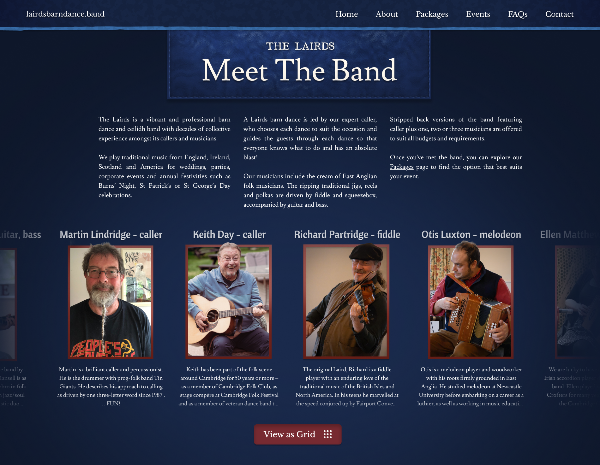
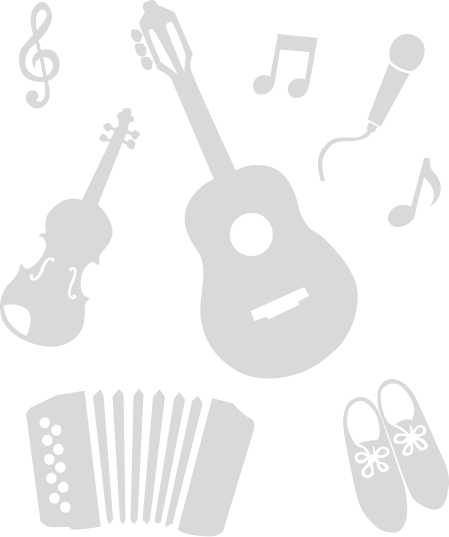
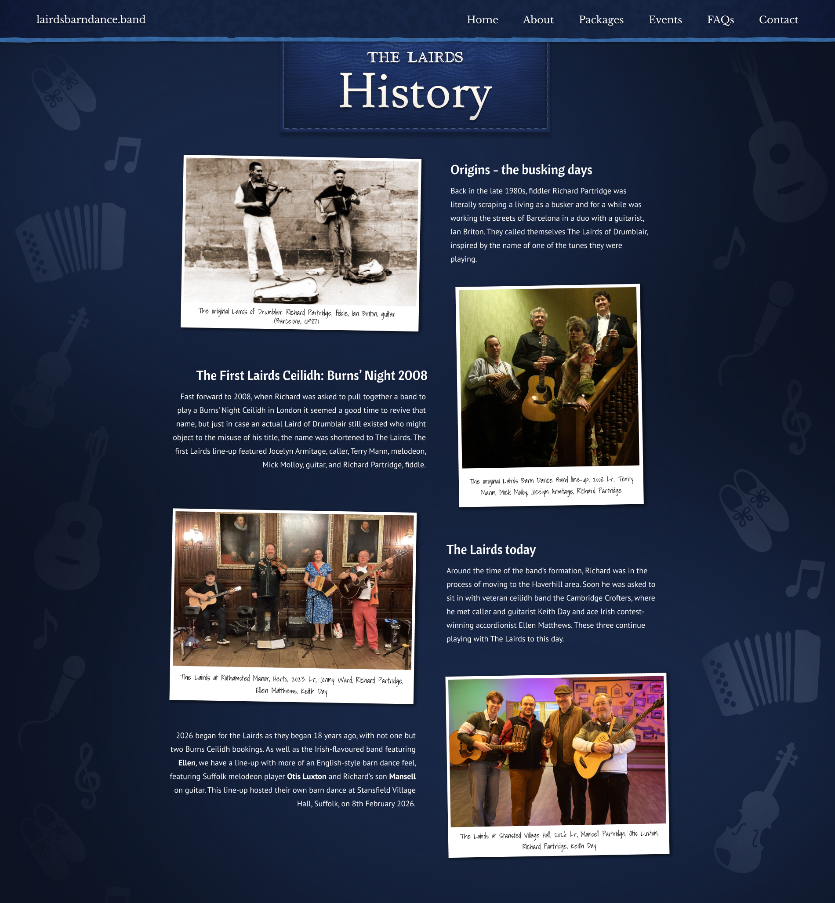

# Timeline
- ## 30/12/2025
    - [First Meeting: 40 minutes](First_Meeting_30-12-2025.md)
        - ### Topics Discussed
            - Chosen Pages
                - Homepage
                - About Us (General description at first, then individuals listed separately later)
                - Packages (Focussing on delivering upfront costs)
                - Contact Us
                - Events (Database Updated Via Spreadsheet, managed by Richard)
                    - Designed now, released once there are a healthy number of gigs
                - FAQs
            - Domain Name
                - lairdsbarndance.band
            - Text Transfer
                - Via Word Document
            - Website Email
                - contact@lairdsbarndance.band
                    - Forwarded to personal email addresses
            - Ceilidh Videography
            - Fees and Services
    - ### Time Spent: 1 hour

- ## 11/01/2026
    - Banner Vectorisation and integration into logo design
    - [Workflow](../assets/temp/11-01-2025.png)
    - 
    - ### Time Spent: 1 hour

- ## 12/01/2026
    - Started working on website mockup, landing page.
    - Used Adobe Firefly for generative expand so the temporary image provided can be used more freely.
    - Experimented with colour palette, concluding with a complimentary navy blue, deep red / brown combination
    - Exploring methods of separating background and subjects. Vignetting, blurring (taken perhaps too far), drop shadows etc.
    - Feedback about formalising colour palette (To do)
    - [Mockup Draft](../assets/temp/Landing%20Page%20First%20Mockup.png)
    - 
    - ### Time Spent: 2 Hours 20 minutes

- ## 13/01/2026
    - Generated [Colour Palettes](../assets/temp/palettes.png) and [Font Combinations](../assets/temp/fonts.png), awaiting feedback
    - 
    - 
    - ### Time Spent: 30 minutes

- ## 02/02/2026
    - Revised Landing page mockup, added reviews on vignetted sides, enhances proffessionalism and builds immediate trust with the user.
        - Updated colours in line with decided [Colour Palette](../assets/temp/Palette.png)
        - 
    - Start About page, experimenting with blue leather stitched title element, and skeuomorphic postcard slideshow
    - ### Time Spent: 1 hour

- ## 03/02/2026
    - Experimented with logo integration into navigation bar / title, so the user is reminded of the name of the band. 
        - [Navigation Option](../assets/temp/navigation_option.jpeg)
        - 
        - [Title Option](../assets/temp/title_option.jpeg)
        - 
    - Continued work on About, adding images and stream of consciousness lairds description.
    - ### Time Spent: 50 minutes

- ## 04/02/2026
    - Created Skeuomorphic Postcard elements with captions, experimenting with paragraph breaks and layout
    - ### Time Spent: 30 minutes

- ## 05/02/2026
    - Lots of text and photos transferred, formatted, added etc.
    - Created [Database (View Only)](https://docs.google.com/spreadsheets/d/1pSWHmoRA7jzdl81XBYCijammbIVrjFhTFQ6Q3Ema29s/edit?usp=sharing)
    - Designed [FAQs Mockup](../assets/temp/faqs_first_draft.jpeg)
    - 
    - ### Time Spent: 2 hours

- ## 08/02/2026
    - Videography for Promo Video
    - Uploaded footage and audio, converted proxies
    - ### Time Spent: 4 hours

- ## 01/03/2026
    - Formatted Database
    - Edited short audio sound test: [audio_test.mp3](../assets/temp/audio_test.mp3)
    - ### Time Spent: 1 hour

- ## 08/03/2026
    - Registered lairdsbarndance.band domain and website email address
    - More track analysis, begun creating new mix incorporating Richard's suggestions
    - ### Time Spent: 1 hour

- ## 09/03/2026
    - Designed first draft of [History Page](../assets/temp/history_first_draft.png) and [Meet The Band](../assets/temp/meet_the_band_first_draft.png)
    - 
    - 
    - Designed Dropdown menu functionality ([Screenshot example](../assets/temp/Dropdown.png))
    - 
    - ### Time Spent: 2 hours

- ## 10/03/2026
    - General admin regarding the layout and content of pages yet to be designed (Packages, Events, Gallery), coming up with these page outlines:
        - Gallery Page
            - Standard (jumbled, variable size) tile matrix, containing all photos
        - Events
            - Details of events, and an image carousel included for events with photographs
                - All managed on spreadsheet and linked to named google drive sub folders
        - Packages
            - Very minimal, text only.
    - Started designing Events Page
    - ### Time Spent: 1 hour

- ## 11/03/2026
    - Updated Meet The Band sub heading font to Cantora One (Free Google Font)
        - Replaced the rounded sans serif with a hybrid serif-handwritten font, slightly more condensed, blends in with the website aesthetic
        - [Example](../assets/temp/meet_the_band_draft_2.png)
        - 
    - Added Contact Information to spreadsheet
    - ### Time Spent: 30 minutes

- ## 15/03/2026
    - Added Packages Information to Database
    - Created detailed first Packages mockup, with a skeuomorphic blue felt noticeboard
        - [Packages First Draft](../assets/temp/packages_first_draft.png)
        - 
        - After discussing this mockup with Richard, we have decided to shift some content around.
    - Created new [Promo Mix](../assets/temp/mix_2.mp3)
    - ### Time Spent: 4 hours

- ## 21/03/2026
    - Redesigned [FAQs mockup](../assets/temp/faqs_second_draft_colour_variation.png)
    - 
    - Started editing promo with [new audio](../assets/temp/Lairds%20Website%20Medley.mp3)
    - ### Time Spent: 1 hour

- ## 22/03/2026
    - Provided 3 FAQs mockup examples...
    - Designed first draft of the [Contact Page](../assets/temp/contact_first_draft.png)
    - 
    - ### Time Spent: 3 hours

- ## 02/04/2026
    - Designed updated [Contact Page](../assets/temp/contact_draft_2.png)
    - 
    - ### Time Spent: 1 hour 30 minutes

- ## 03/04/2026
    - Completed Blue Leather Label...
    - 
    - 
    - Updated text on [Contact Page](../assets//temp/contact_draft_3.png)
    - 
    - Manually cut out all [package photos](../assets/temp/packages_cut_outs.png)
    - 
    - ### Time Spent: 3 hours 30 minutes

- ## 04/04/2026
    - Completed [Packages Mockup](../assets/temp/packages_redesign_draft_1.png) <br><br>
     
    - [User clicks:](../assets/temp/packages_redesign_draft_1_user_interaction.png) <br><br>
     
    - ### Time Spent: 2 hours 15 minutes

- ## 06/04/2026
    - Added Events Table to Database, Updating Google Drive Folder naming convention to just the date of each event. I then verefied the technical feasabiltiy of this time-efficient solution using the Google Drive and Google Photos API documentation, determining that a node server backend would greatly improve the data fetching and managment of the website.
    - Converted attached screenshot of review from newsletter to text and updated Richard about inserting reviews with multiple paragraphs (using `<br>` in plaintext)
    - Added Google Drive Folder link to title of Events Page for easy access.
    - ### Time Spent: 45 minutes

- ## 12/04/2026
    - Added README.txt to Gallery Drive Folder, detailing the folder naming convention etc.
    - Designed [Events First Draft](../assets/temp/events_first_draft.png) <br><br>
    
        ```
        Full name or first name for musicians?
        Mockup shows different types of event entries (minimal / all content available)
        Custom icons for each package type?
        ``` 
    - ### Time Spent: 2 hours 30 minutes

- ## 17/04/2026
    - Designed [Events Page Skeuomorphic Mockup](../assets/temp/events_draft_2_temp.jpg)

    - 

    - ```
        To ensure the page conveys quite how busy and in-demand the band is, the design will aim to fit as many events on screen as possible at any given time (i.e. reducing each entry to roughly two lines in its default state). The top (most recent) event will appear expanded by default, with media arranged around the central card to make fuller use of the available space — for instance, images and videos presented as postcards, and audio through a minimal, skeuomorphic player.

        As the user scrolls, this first event will contract back into the list, and crucially adopt a slight rotation, so that the timeline begins to read as part of a turning wheel. I can expand on the wheel idea as a more distinctly skeuomorphic element in its own right, but I think it make be best to keep the list clean and easily readable, with minimal visual overlay.
    
    - ### Time Spent: 2 hours

- ## 18/04/2026
    - Begun redesigning the home page. 
    - Created [Logo font variations](../assets/temp/Logo_font_variations.png), stuck with the original

    - 
    - Explained to Richard about the use of a subdomain (irish.lairdsbarndance.band) as an option to separate the band identities with no extra cost.
    - ### Time Spent: 1 hour

- ## 19/04/2026
    - Designed updated [Packages Mockup](../assets/temp/packages_draft_3.png) and updated interaction mockups accordingly.

    - 

        - Changed all package titles to "[package] and caller"
        - Changed the colour of the leather for fiddler and caller to match the lighting and help improve overall colour harmony.
        - Colour corrected (strange filter on original), cut out Bluegrass photo and tightened gaps between band members to ensure consistency with other packages.

    - Created [example of interaction](../assets/temp/faqs_interaction.png) with FAQs page, with slight change. When the post-it unfolds, the noticeboard doesn't resize (seems obvious now...)

    - 

    - Designed incomplete [Landing Page Redesign](../assets/temp/landing_page_redesign_draft_1.png)

    - 

        - Updated Logo, including "Barn Dance Band", scaled down to be more in proportion with the rest of the text on the page.
        - Reviews shifted up to make use of space around logo + improves text contrast.
        - White box replaced with three page cards, with blurred translucent background to help fuse both sections.
    
    - Added Reviews Table to Homepage spreadsheet on Database

    - ### After Feedback
        - Reverted call to action to original on Homepage
        - Removed Red Contact Button so all navigation elements appear equal

    - 

    - ### Time Spent: 3 hours

- ## 20/04/2026
    - Implemented final changes and created [Mockups showcase](https://docs.google.com/presentation/d/1-tm2mFM2LmII1lwuN4BDSVMF9b_fLrK8glRqFbXG51w/edit?usp=sharing)

    - 

    - ### Time Spent: 1 hour 30 minutes

- ## 22/04/2026
    - Read feedback from Richard about Mockups showcase and updated him on what will be implemented to finalise the Mockups, ready for a review with the band.

        - 

    - Updated Packages Page with correct photos. Suggested a professional reshoot of all packages.

    - ### Time Spent: 1 hour

- ## 26/04/2026
    - Implemented real quotes into home page.
    - Replaced flipped version of Keith with a different image.
    - Continued redesigning Meet The Band Page
    - ### Time Spent: 45 minutes

- ## 30/04/2026
    - Added Otis' card to Meet The Band mockup, made final adjustments. Suggested a refactoring of the layout, since the page was starting to feel vertically disproportionate with the added introductory text.
    
    - 

        - The band members scroll horizontally like a carousel (with a subtle 3D wheel effect if desired), which just adds a bit more life into the page. The option to view as grid is also present for accessibility reasons.
    - Updated [Mockups Showcase](https://docs.google.com/presentation/d/1-tm2mFM2LmII1lwuN4BDSVMF9b_fLrK8glRqFbXG51w/edit?usp=sharing)

    - ### Time Spent: 2 hours

- ## 03/04/2026
    - (Sans/Serif) Font Comparisons, side by side. Viewport scale check etc.
        - Decided on PT Sans as a potential sans-serif improved-readability replacement to Lusitania
    - Responded to feedback from two new people.
        * 
        ```
        Enhance user flow - I'm not so keen on the buttons / coloured hands idea as this risks overcomplicating the user flow. I appreciate you want to prescribe a particular journey through the website, so let's think about slightly more dynamic ways we can do this.
        ```
        * 
        ```
        Change the background / add more contrasts to the pages - I have been thinking for a while that something needs to be incorporated into the background to avoid each page looking flat. I think the blue theme works well - it just needs subtle geometric contrast in the background. If they think it's "too blue", then maybe we should consider desaturating the blues present on the website, but I would prefer another opinion on this before we make that change. About the geometric contrast idea - a lot of minimalist websites include thematic vector-style images in the inline space of the background (area left and right of the content). Therefore, should I create a mockup using the History page, incorporating barn dance instruments as minimalist silhouettes?
        ```

    - ### Time Spent: 1 hour 30 minutes

- ## 05/05/2026
    - Agreed upon PT Sans as new font for body text.
    - Designed and incorporated new "peripheral ornaments" concept to History Page.

    - 

    ```
    After a lot of iterations, I think I've landed on something tasteful, that quietly fills in the peripheral margins. The vectors are arranged randomly, with their opacity tied to the gradient that was there originally. I've tried to find the right balance of abstraction with each vector, but if you want them to be more or less detailed, just let me know. The instruments will employ a parallax scroll, where they scroll slower compared to the main content on the page. This makes each page feel slightly more dynamic and three dimensional, whilst also reducing perceived repetition in the arrangement of the vectors.
    ```

    - 

    - Breakdown of changes:
        - Updated Text and captions
        - Updated body text to the website's new sans-serif font: PT Sans - much better!
        - Changed alignment of text - left and right alignment respectively instead of justified, to complement the visual flow and prevent the page from looking too rigid. 
        - Adjusted postcard rotation - ±1° instead of 2. Feels slightly more stable and professional 
        - Added barn dance vectors as described in first message

    - ### Time Spent: 2 hours

- ## 06/05/2026
    - Continued updating History Page
    - 
    
    ```
    As well as increasing the body text by 1 pt (you were right to point that out), I've simplified the alignment, displaying the content as strict columns rather than the previous, freer arrangement, that in hindsight appeared unharmonious and ineffective.
    ```

    - Created new header design, replacing the blue leather tag.
    - 
    ```
    the new header provides much needed contrast as well as incorporating the red accent colour an an otherwise entirely blue-themed page.
    ```
    - ### Time Spent: 1 hour 15 minutes

- ## 07/05/2026
    - Begun sketching new instruments in a folky, minimalist style.
    - 
    ```
    Tomorrow I'll work on some slightly more minimalist variants. At the moment, the line fidelity isn't even, so I need to find a look that doesn't distract the viewer and simply looks convincing and fitting). Once we're happy with the guitar, I'll attempt to produce similar line drawings of the other instruments.
    ```
    - Richard had the revelation of mimicking woodcuts, which aligns much more closely with the website's aesthetic, and intergrates itself into the background logic (as if woodcuts are stamped on sporadically).

    - ### Time Spent: 45 minutes

- ## 08/05/2026
    - Drew woodcut, using Praetorius' Syntagma Musicum as inspiration. Used Figma's texture filter to non-destructively add the appropriate wobbliness
    - 
    - Sent through mockups with it incorporated, line-drawing and inverted filled-in versions.

    - Edited and colour graded promo video footage. 
        - Synced available footage to provided “Lairds Medley” audio where possible. Limited usable footage for intro/outro sections, requiring alternative clips. Majority of 4-piece footage recorded during interval pieces, making synchronisation with lively medley sections difficult. Suggested inclusion of a short interval-performance clip due to stronger footage quality and unobtrusive camera positioning. 
        - Recommended reducing promo duration to ~2 mins to minimise unsynchronised material, with possibility of filming a more polished, fully synced promo at a later date.

    - ### Time Spent: 2 hours 15 minutes

- ## 10/05/2026
    - Designed new navigation menu, incorporating the blue leather motif
    - Continued implementing site-wide changes, completing the Homepage, FAQs and Events
        - PT Sans replaces Lusitania
        - Red and White Banner replaces Blue Leather Tags
        - (placeholder) instrument background applied to all pages
        - Buttons added to pages to guide the user through the process
    
    - ### Time Spent: 3 hours

- ## 11/05/2026
    - Prepared all pages for the Mockups Showcase, viewable with this link: [bit.ly/lairdsbarndance](https://bit.ly/lairdsbarndance)
        - **General**
            - Updated Navigation Menu, separating "About" into "History" and "Meet the Band".
            - Updated fonts (Lusitania => PT Serif / PT Serif Condensed), standardising Cantora One as heading font
            - Added instrument motifs to background, vignetting / masking according to content
        - **Homepage**  
            - Updated Text and Fonts
            - Added stitching to bottom of main section to mirror navigation menu
            - Increased font size of call to action
            - Added background musical instruments
            - Normalised quote font size
        - **FAQs**
            - Suggested design variant replacing PT Serif with more characterful Caveat, adhering to visual logic as handwritten notes
            - Replaced watermarked paper texture for free alternative, improved texture visibility and mask precision
        - **Meet the Band**
            - Recfactored visual hierachy, moving band carousel to top and transformed text columns into cards, using the FAQs paper note motif.
            - Reduced biography max-height to 4em
    - Created Website Mockup Prototype, linking all pages together to function as a website.
        ```
        I'm trying something new here - you should be able to interact with the mockups as a website. Apart from page-specific interactions, where clicking anywhere on the page will queue the predetermined example interaction, navigation menu and buttons should work to help you go between pages.
        I think this is a more effective way of showcasing the mockups, as it displays them fullscreen in a web browser, rather than contained in a slide powerpoint. Also, the accompanying text was a bit pointless, as the mockups should be able to speak for themselves.
        ```

    - ### Time Spent: 3 hours 30 minutes

- ## 12/05/2026
    - Moved Meet the Band second section to Homepage, added buttons to appropriate cards
    - Improved FAQs design variants
    - Created Figma Prototype with flow. Functioning navigation menu, buttons and draggable design variants.
    - Finishing touches to all pages.
    - ### Time Spent: 1 hour

- ## 15/05/2026
    - Added Welcome Screen to Mockups Showcase
    - Fixed issues with user flow, added prototype functionality etc.
    - 
    - ### Time Spent: 30 minutes

- ## 16/05/2026
    - Minor text and user flow updates
    - Query about caption style
    - ### Time Spent: 20 minutes

- ## 17/05/2026
    - Created mailbox: laird@lairdsbarndance.band
    - Updated Jonny's photo in Meet The Band
    - ### Time Spent: 25 minutes

- ## 26/05/2026
    - Created Irish Lairds Homepage
        - .heic to .png conversion to ensure quality.
        - Manual vector cut-out, then refinement with photoshop for hair etc.
        - Perspective correction, further compensation to Keith who appeared slightly stretched due to the harsh perspective warp
        - Creation of cleanplate (background)
        - Compositing, adjusting brightness of vignette
        - Rearranging quotes to accomodate for Tony's height.
    - 
    -  
    - ### Time Spent: 1 hour 20 minutes

- ## 27/05/2026
    - Lots of discussion surrounding reconfiguration of pages and some additions to improve user experience (Many temporary mockup variations were created to realise Richard's suggestions). After lots of back and forth and my justification of the current designs, we had agreed to stick with the current designs but bring forth a few additions.
        - Third photo added to fullscreen homepage carousel
        - Contact Prompt at the bottom of the Hompage
    - ### Time Spent: 1 hour 30 minutes (45 minutes of consultation)

- ## 28/05/2026
    - Reverted Biographies to suitable, longer length, preserving the shortened biographies in a separate column in the table
    - Initialised Backend
        - Established Google Cloud Console account for the website
            - Google Sheets API
            - Relevant Credentials
        - Wrote code to fetch and parse a customised json object
            - parse_table()
                - receives table as defined named range and outputs javascript object, using keys from top row of table
                    - True booleans
                    - Parsed GB dates (including all variations of incomplete digits, i.e. dd/m/yy)
                    - Comma Separated entries as arrays
            - parse_document()
                - follows the document structure, where entries are written with a heading and content beneath, and separated by a blank cell
                - object includes tags, that will be linked to a data attribute to allow for seamless html integration

    - ### Time Spent: 1 hour 30 minutes

- ## 29/05/2026
    - Continued integrating quasi-backend
        - Images are stored in a public Google Drive directory and synchronised to a Google Sheet via an Apps Script crawler. The script recursively scans the Drive folder structure, appending new file metadata — including folder path, filename, MIME type, and Drive ID — into a read-only spreadsheet tab used as a lightweight CMS/database layer. The GitHub Pages frontend fetches this sheet data via the Google Sheets API and renders images directly from Google’s CDN endpoint (lh3.googleusercontent.com) using the stored file IDs. Synchronisation can be triggered manually from within the spreadsheet or automatically via scheduled Apps Script triggers.
        - This approach keeps the entire system lightweight, serverless, and inexpensive by relying solely on Google Drive, Google Sheets, Apps Script, and GitHub Pages. No Node.js server, database infrastructure, or paid backend hosting is required.
    - Designed frontend integration, html is written in the following manner. 
        ```html
        <div class="dyn-container" data-dyn-tag="socials" data-dyn-heading="h1" data-dyn-content="h3"></div>
        ```
        Content is automatically populated in the parent container, using content from the spreadsheet.
    - One consideration: generating html of fairly up-to-date copy of website as backup + improved web crawling and SEO
    - ### Time Spent: 2 hours 30 minutes
    